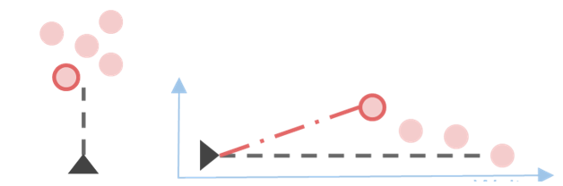
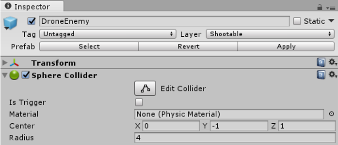
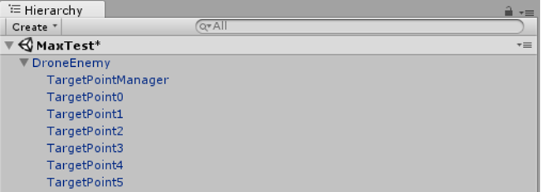
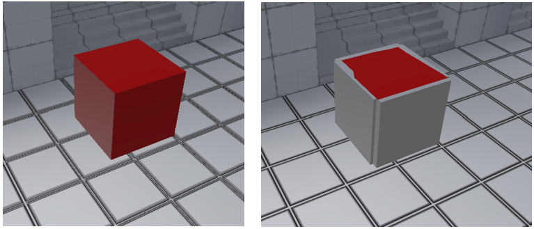
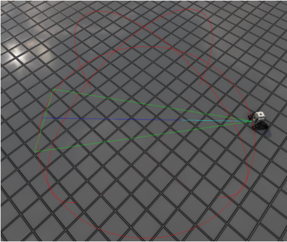
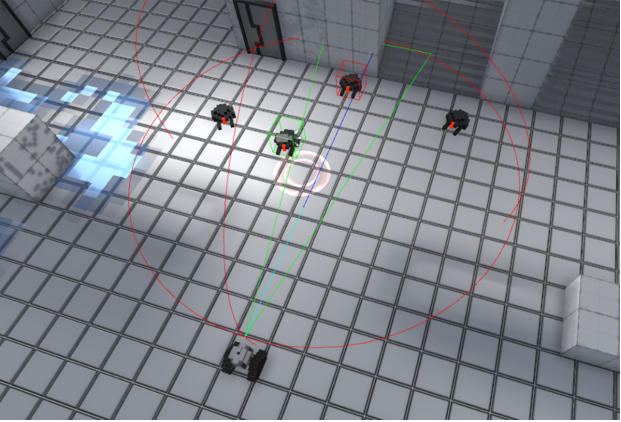
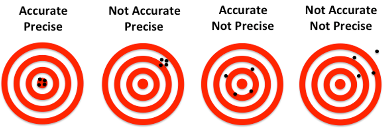
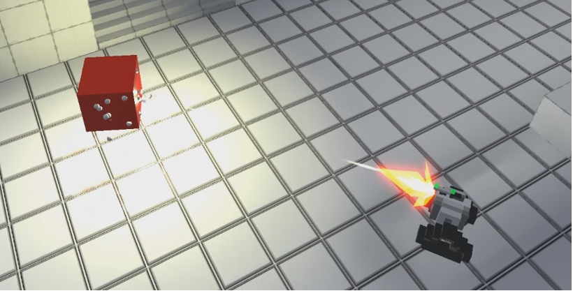
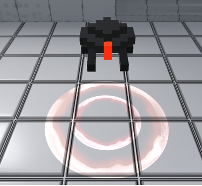

# Intelligent Targeting Assistant 
 
## Idea 
 
In games, it is usually hard to shoot at the desired target you want, especially, if you use a joystick and are not that experienced. The player model always shoots in the direction it is aligned to. Furthermore, shots are often fired at the same height and do not differentiate between the parts of the enemy body. 
The Intelligent Targeting Assistant should support the player to shoot on the desired target. Therefore, it knows in which direction the player model is facing and evaluates the best target in front of him, even if there is more than one possible target. It also differentiates between the parts of the enemy body and uses accuracy and precision to shoot on them. Besides, it does not always shoot on the same spot of the body part, even if the player and target do not move. It actually changes body parts, if the weapon is inaccurate and imprecise. 
 
## Challenge 
 
- Easy to use, designed for casual players 
- One joystick for (horizontal) aiming 
- Vertical aiming because of different enemy types (flying versus walking enemies) and different levels 
- Because the perspective of the game is top down, vertical aiming must be automatic 
- Player should always shoot at the desired target 
 

Figure 1: The player model should always aim at the desired target, no matter if it is positioned higher than the others. (Right coordinate system: vertical axis: height, horizontal axis: horizontal distance) 
 
 
## Implementation 
 
### Prerequisites of targetable objects 
 
To differentiate between targets that are targetable and those which should not be shot at, we defined a layer called “Shootable” for all targetable game objects in the scene. Every object using this layer can be targeted by our Intelligent Targeting Assistant. In addition to this, they all need to have at least one active collider. 
 

Figure 2: Inspector of an enemy with the needed layer “Shootable” and collider. 
 
Furthermore, the targetable game object needs one child with the attached script component “TargetPointManager.cs” and at least one squared or round game object with the script component “TargetPoint.cs” attached to each of them. The TargetPoints have their renderers deactivated. 

Figure 3: Targetable object with the needed TargetPointManager and TargetPoints. 
 
Each TargetPoint represents a region of the targetable object, at which can be shot at. It can either be a squared rectangle or a round circle and must be set in the components preferences. Its size or radius conforms to the region, which can be hit, if one shot is directed to the TargetPoint. There is also an option to make the TargetPoint a critical or uncritical region, so the target can get higher damage when a critical region is hit. Lastly, there is an option for the angle, in which the TargetPoint can be hit. The opening of the angle faces to the local z-axis of the TargetPoint and can only be hit, when the player is positioned in the angle.  
The TargetPoint game objects can be attached to every child game object of the targetable object’s hierarchy. Thus, during gameplay, they are moved by the local motions of the parent object like arms or legs. 

Figure 4: On the left side is a targetable object without rendered TargetPoints and on the right, it has rendered TargetPoints, which cover all sides. 
 
The TargetPointManager finds and knows each of the targetable object’s TargetPoints and remains as the contact component for other scripts. For each TargetPoint, it calculated which are the nearest other TargetPoints with an angle overlapping its angle. 
 
### Target detection 
 
To find out if there are targets in front of or around the player, we built a system which casts in front or around the player model a Unity built-in “Physics.OverlapSphere” (red lines in Figure 5 and 6) and detects all targetable objects in it. The dimension of the sphere depends on the range value in the settings of the currently used weapon.  
Then it sorts out the targetable objects, which are not in the right angle (green lines in Figure 5 and 6) in front of the player. Therefore, we calculate the line intersections of the targetable objects, while ignoring the y-axis (height of them). The angle can be set in the settings of the currently used weapon as well. If the angle is bigger than 180°, the OverlapSphere is casted around the player model, otherwise, in front of the player model. 
Finally, it sorts the targets from nearest to farthest.  
 

Figure 5: The visualized OverlapSphere in front of the player. Red is the sphere with the dimension of the weapon’s range. Green is the angle in which the targetable object can be shot. Blue is the local z-axis of the player model showing the direction it is faced to. 
 
Every targetable object is stored in an array and can be queried by the main system script. It calculates the main target’s hit TargetPoints for all requested shots of the weapon.  
 

Figure 6: Valid target objects are marked by boxes (green: main target, red: further targets). 
 
For this purpose, the main system script uses the accuracy and precision of the weapon, which can be set in its options. The higher the accuracy, the more shots will be land in the center of the TargetPoint. The higher the precision, the higher is the chance that all shots are near to each other. Besides, it uses the critical hit rating of the weapon to higher the chance to target critical TargetPoints. 
 

Figure 7: Illustration which shows the differences between accuracy and precision. (Source opened 21st of September 2017: http://www.dnasoftware.com/ourproducts/copycount/precision-and-accuracy/ ) 
 
That means that each shot (even in a salve) is likely to have a different destination point. The TargetPoint could even differ from the last shot’s TargetPoint.  

Figure 8: Shooting from the same position without changing the direction. The white spheres illustrate the bullet holes on the hit TargetPoints. The TargetPoints changed because of the accuracy and precision of the weapon. 
 
Each weapon has its own projector preference, which is used to mark the main target in the game scene. It appears above the Intelligent Targeting Assistant’s preferred targetable object facing downwards to the ground.  

Figure 9: A projector marking the preferred targetable object by the system. 
 
## Result 
 
Overall, it can be said that the system works very well. It detects every targetable object without any difficulties and accurately chooses the desired target. Each aspect of the Intelligent Targeting Assistant can be adapted to the project’s requirements.  
Even though, we tried to get better algorithms than picking the targetable object with closest range to the player model, we decided to use that one because it had the most satisfying output. Other approaches, like calculating results with the distance to the player model and the distance to the normal of the player model’s facing direction, did not work out. 
Furthermore, the system calculates satisfying destinations on and switches between the TargetPoints based on the preferences of the used weapon.  
 
## Outlook 
 
In this component, care was taken to ensure that high performance needs were carried out as sparingly as possible. Nevertheless, there could be done some optimization research, even though the performance is good and the code is efficient.  
Mainly, there should be done further research in the used algorithms to decide the desired target or get better bullet holes, to become more accurate and realistic. Nevertheless, in the top-down-perspective our approaches deliver good results. 
